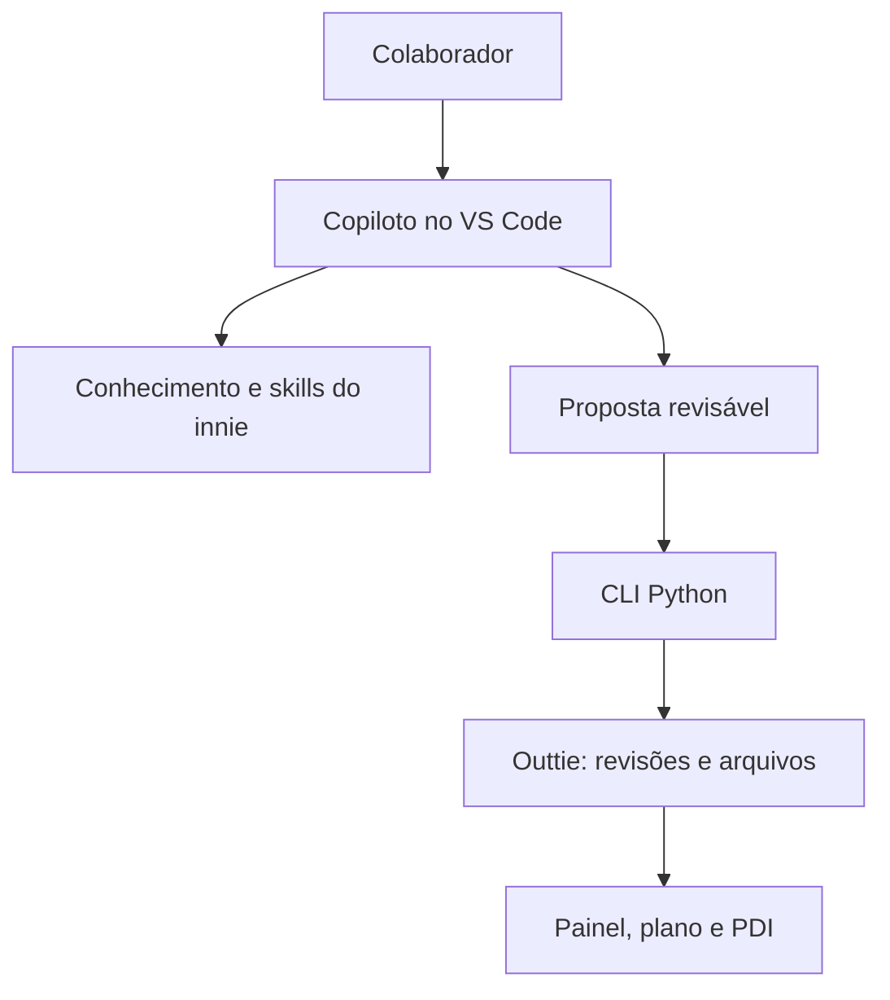

# Arquitetura implementada

## Objetivo e responsabilidades

O sistema une conhecimento institucional, procedimentos de IA e ferramentas locais para acompanhar desenvolvimento ao longo do ciclo. O colaborador fornece contexto e revisa; Copilot interpreta e propõe; scripts preservam e validam; liderança/RH confirmam critérios institucionais.

Um único assistente é visível para uso diário. Especialistas podem ser usados como subagentes se a integração suportar; caso contrário, as responsabilidades são executadas sequencialmente. Não há orquestrador remoto ou inferência dentro do Python.

## Innie

`.github` contém agentes, skills, instruções, prompts e CI. `knowledge` contém regras, matriz DevOps limpa, orientação de evidências e fontes institucionais. `src/pdi_copilot` contém ferramentas. `docs` é documentação atual; `docs/planning` preserva a especificação original. `pessoal` é um symlink ignorado apontando ao outtie.

## Outtie

`metadata.json` é o ponteiro de revisão com hash. `revisions/NNNNNNNN.json` são snapshots completos. `sources` preserva originais/extrações; `evidence/files` aceita materiais associados; `inbox` recebe dados e propostas auxiliares; `proposals` guarda operações candidatas; `cycles/ID/outputs` contém visões e `notes` contém texto autoral; `archives` contém encerramentos; `exports` contém saídas de PDI; `operations` guarda recibos/recuperação; `.runtime` contém lock e hashes das visões.

## ADR-001 — snapshot completo como fonte canônica

O plano propunha várias tabelas JSON mutáveis por ciclo. A implementação publica um snapshot completo por revisão, com arrays para essas entidades. Isso reduz o problema de uma falha entre escritas de arquivos diferentes. As visões por ciclo podem ser regeneradas.

Passos de commit: validar → gravar revisão candidata → fsync → calcular hash → substituir metadata atomicamente. O lock POSIX evita escritores simultâneos nos scripts. Uma falha antes da troca de metadata mantém a revisão antiga ativa. Uma revisão órfã é preservada em operations na próxima tentativa. Um conflito de revisão impede aplicar uma proposta antiga.

Não editar snapshots: isso altera hashes. Atomicidade local não torna o filesystem infalível; manter backups.

## ADR-002 — outtie é armazenamento real

O link permite operar no innie sem cópia/sincronização bidirecional. Atualização do innie não substitui dados pessoais. Inicialização de Git do outtie é opcional. Nenhum script cria remotes ou envia dados.

`.gitignore` não é isolamento de acesso. Instruções e ferramentas read-only de especialistas são controles do harness, não sandbox completo. Os scripts verificam caminhos para escrita e o Git para inclusão acidental. O modelo pode ler o contexto autorizado das duas áreas; dados usados no contexto podem ir ao serviço de IA.

## ADR-003 — nada de calendário institucional presumido

Um ciclo pode ser criado sem datas como rascunho. Ativação exige início, fim e corte. Datas da avaliação e fechamento do PDI são independentes. A mudança para maio/2027 e março/2028 é informação a configurar, não uma constante do código. Janelas usam meses de calendário e deixam limites exatos pendentes quando não confirmados.

## ADR-004 — dados institucionais versionados

O pacote processa a documentação recebida de 2025, com vigência pendente. A matriz DevOps não contém anotações pessoais; percentuais da exportação individual não viram regra. O fechamento copia knowledge para o archive. Novas versões do núcleo não reescrevem arquivos encerrados.

## ADR-005 — revisão humana e semântica

Python valida estrutura, vínculos, datas, status, hashes, conflitos e limite de exportação. O Copilot e o usuário verificam relevância, autoria, qualidade de evidência e utilidade do plano. Aprovação de proposta local não equivale a confirmação institucional. O revisor de consistência não é um RH automatizado.

## Capacidades e limites operacionais

Importação preserva arquivos e extrai texto de MD/TXT/JSON/CSV/HTML; PDF com Poppler disponível. Imagens são preservadas e exigem inspeção pelo assistente ou revisão manual. Não há OCR obrigatório. Não há acesso automático a links privados ou envio de mensagens. Logs/recibos não gravam conteúdo do chat.

`migrate` valida o schema atual, mas não transforma schemas futuros ou layouts desconhecidos. Para estes, usar importação assistida em espaço novo. Não há monitor contínuo de prazos: alertas são exibidos quando o sistema é usado.
