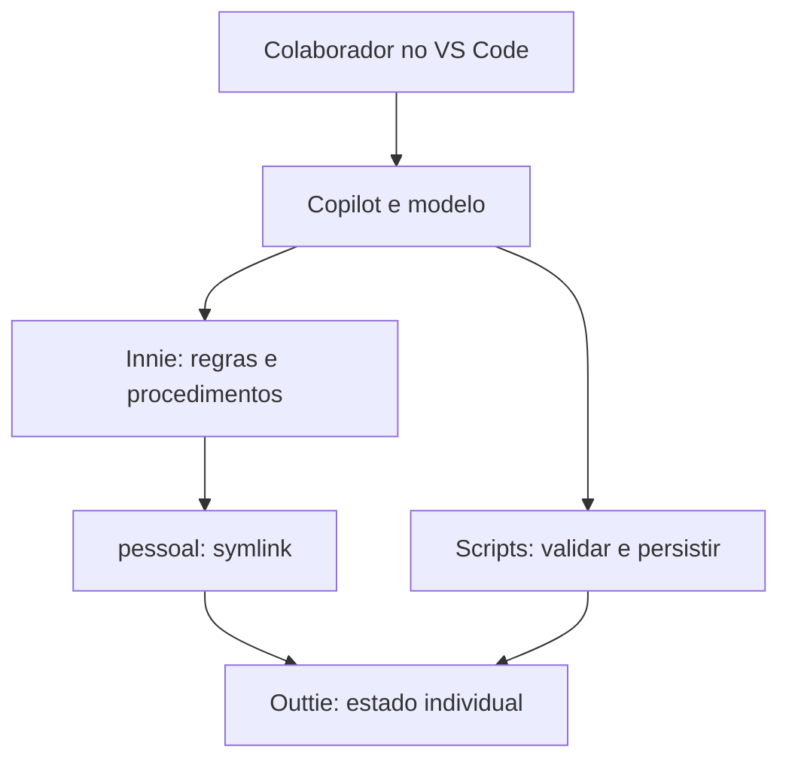
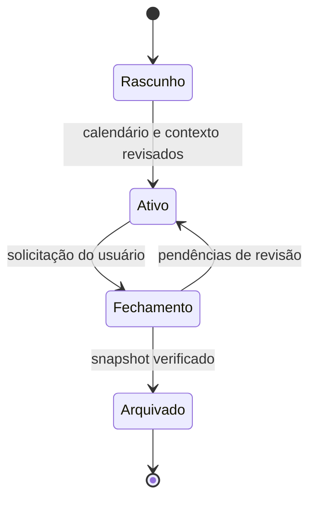

# 03 — Arquitetura, dados e ciclos

## 1. Princípios

O núcleo institucional é versionado e compartilhado; o estado individual é separado. A conversa serve como interface, mas arquivos persistidos são a memória do produto. Modelos interpretam e propõem; scripts fazem cálculos, validações, controle de versões e operações de arquivos. Não depender de uma conversa indefinida ou de arquivos livres como único estado.

Usar JSON como formato estruturado inicial para reduzir dependências; Markdown para leitura e saídas. Não haverá servidor permanente no primeiro piloto. O produto precisa funcionar quando o usuário voltar com uma conversa nova.

## 2. Ambiente WSL2

Proposta de instalação: VS Code no Windows conectado ao Ubuntu pelo suporte WSL; Git, Python 3 e scripts executados no ambiente Linux. Preferir armazenar ambos os espaços sob uma pasta do usuário no filesystem Linux, por exemplo `~/pdi-copilot/`, sem fixar o nome do usuário nos arquivos distribuídos. Verificar as extensões necessárias no contexto remoto e autenticação do Copilot.

O workspace salvo dentro do `innie` abre esse núcleo. O acesso cotidiano aos dados ocorre por `pessoal`, um link para o `outtie`. Não é necessário manter uma segunda raiz aberta para a experiência inicial. Se a leitura de symlinks/arquivos ignorados falhar, testar uma configuração com o `outtie` como segunda raiz no mesmo workspace. Essa alternativa mantém o `outtie` como fonte real e não cria cópias divergentes; ativá-la apenas depois de verificar descoberta de instruções e acesso aos arquivos.



Os componentes internos não pressupõem delegação automática disponível em toda versão. O protótipo pode executar as responsabilidades sequencialmente no mesmo assistente.

## 3. Layout do `innie`

```text
innie/
  README.md
  AGENTS.md
  .gitignore
  pdi.code-workspace
  .github/
    copilot-instructions.md
    agents/
    skills/
    prompts/
    instructions/
  knowledge/
    index.json
    policies/
    criteria/
    competencies/
    evidence-guidance/
    sources/
    validation-decisions/
  schemas/
  templates/
  scripts/
  docs/
  tests/fixtures-sinteticas/
  pessoal -> ../outtie
  .local/
```

`pessoal` e `.local` são ignorados pelo Git. A entrada proposta `/pessoal`, sem barra final, corresponde ao link. `.local` contém configurações de instalação e logs técnicos mínimos; não deve concentrar dados insubstituíveis. Paths absolutos ficam na configuração local ignorada. O conteúdo distribuído não inclui dados de André nem de outro colaborador.

`AGENTS.md` registra contratos canônicos gerais. O arquivo específico do Copilot fornece orientação breve e referências. Evitar duplicar regulamentos em ambos. `knowledge` contém fatos institucionais processados e fontes de suporte; skills contêm procedimentos. Os formatos e lugares efetivamente descobertos serão testados.

## 4. Layout do `outtie`

```text
outtie/
  metadata.json
  profile/
    profile.json
    role-history.json
    career-goals.json
  sources/
    originals/
    extracted/
    registry.json
  evidence/
    files/
    index.json
  inbox/
  cycles/
    <cycle-id>/
      cycle.json
      institutional-snapshot/
      baseline/
      state/
        objectives.json
        actions.json
        criterion-assessments.json
        competency-assessments.json
        metrics.json
        events.json
      proposals/
      outputs/
        painel.md
        plano.md
        pdi/
        p2p/
        marcos/
      history/
      snapshots/
  archives/
    <period-label>__<cycle-id>/
  operations/
  backups/
```

Perfil, fontes e catálogo de evidências são globais ao espaço individual. Estado, interpretação e saídas são específicos de cada ciclo. O material de encerramento vai para `archives`, com período e ID. Arquivos originais não são modificados por interpretação da IA.

O symlink só cria acesso; não sincroniza nem copia. Copiar e recuperar o `outtie` preserva os dados reais. Copiar apenas o `innie` não constitui backup. Snapshots dentro do próprio `outtie` ajudam a desfazer alterações, mas não protegem contra perda do disco ou da distribuição WSL; deve existir uma opção de backup do espaço inteiro para outra localização escolhida pelo usuário.

## 5. Contratos de dados

Todos os registros possuem `id`, `schema_version`, `created_at`, `updated_at` e referências de origem quando aplicáveis. IDs não mudam quando títulos ou prazos mudam. Timestamps incluem fuso; datas de negócio usam ISO `AAAA-MM-DD`, com localidade inicial `America/Fortaleza`.

| Entidade | Campos específicos essenciais |
| --- | --- |
| Perfil | Função, senioridade, step e origem, área, vertical, cliente, liderança, idiomas, capacidade |
| Ciclo | ID, rótulo, início, fim, corte, fechamento do PDI, avaliação, marcos, status, timezone, versão institucional |
| Fonte | ID, arquivo/URL, hash local quando disponível, natureza, autor conhecido, datas e restrição de acesso |
| Critério | ID, escopo, tipo por valorização, janela, evidência requerida, fonte e vigência |
| Avaliação de critério | Ciclo, critério, data de referência, situação, evidências, responsável e justificativa |
| Avaliação de competência | Skill, nível, referência atual/alvo, avaliador, tipo de avaliação e data |
| Objetivo | Intenção, horizonte, competência, sucesso esperado, prioridade e confirmação |
| Ação | Objetivos, critérios, descrição, prazo, esforço, dependências, entregas, status e evidências |
| Evidência | Data real, registro, autor, contribuição pessoal, arquivo/link, verificação, relações e resultado |
| Evento | Tipo, fonte, fatos extraídos, propostas, duplicidade e decisão |
| Métrica | Nome, fórmula, unidade, baseline, período, fonte, observação e natureza oficial/experimental |
| Exportação | Ação, texto, caracteres, hash/versão, criação, situação de cópia para Team Guide |
| Mudança | Estado anterior esperado, operações propostas, motivo, efeito, revisão e resultado |

Valores desconhecidos são `null` com motivo, e não zero. Datas estimadas têm marca de confirmação pendente. Dados pessoais em uma fonte institucional mista são separados no processamento.

### Exemplo de configuração de ciclo, deliberadamente incompleta

```json
{
  "schema_version": "1.0",
  "id": "ciclo-2026-2027",
  "label": "Ciclo com avaliação prevista para maio de 2027",
  "timezone": "America/Fortaleza",
  "starts_on": null,
  "ends_on": null,
  "evidence_cutoff_on": null,
  "pdi_closes_on": null,
  "evaluation_on": null,
  "expected_evaluation_month": "2027-05",
  "calendar_confirmation": "pending",
  "status": "draft",
  "milestones": [],
  "policy_version": null
}
```

O mês informado permite rascunhar cenário, mas não comprovar validade de janela no limite nem calcular um prazo oficial. Datas concretas precisam ser preenchidas antes de consolidar um cronograma comprometido.

## 6. Estados e significados

### Ciclo

`draft → active → closing → archived`. O ciclo só vira ativo com calendário suficiente, regras selecionadas e revisão inicial. Pode haver rascunho do próximo ciclo, mas apenas um ativo no piloto. O resultado institucional pode chegar depois de arquivar: registrar um adendo versionado, sem alterar o snapshot original.

### Ação

Estados: `proposed`, `planned`, `in_progress`, `done`, `suspended`, `cancelled`, `carried_over`. O estado de comprovação é independente: `missing`, `claimed`, `inspected`, `reviewed`, `institutionally_confirmed`. Uma ação `done` pode ter evidência `missing`. Atraso é calculado a partir de prazo/status; não é uma etiqueta que o assistente pode apagar.

### Critério

`not_applicable`, `unknown`, `pending`, `supported`, `confirmed`, `expired`. `supported` significa que há documentação pertinente revisada pelo produto; `confirmed` requer identificação de validação institucional quando necessária. Não chamar `supported` de elegibilidade garantida.

## 7. Atualização transacional

1. Salvar entrada original e identificar duplicatas por hash/ID quando possível.
2. Ler o ciclo ativo e sua versão, carregar somente contexto relevante.
3. Extrair fatos com fonte e identificar ambiguidades.
4. Criar proposta de mudança em `proposals` sem escrever sobre o estado vigente.
5. Validar IDs, schema, caminhos, datas, capacidade, fontes e vínculos.
6. Mostrar alterações materiais ao usuário: o que muda, por quê e efeito no cronograma.
7. Com revisão obtida, o script persiste uma nova versão sob lock e registra a operação.
8. Gerar as visões Markdown da versão aplicada.
9. Registrar decisão e atualizar painel.

Registrar uma entrada na inbox não precisa de uma segunda confirmação. Alterar objetivos, compromissos, prazos oficiais, cancelar ações ou transferir entre ciclos exige revisão específica. Captura rotineira pode ser automatizada conforme preferências do usuário, preservando autoria e sem elevar a situação de comprovação.

Para múltiplos arquivos, escrita atômica de cada arquivo não basta. Proposta: criar snapshot candidato em diretório temporário, validar completo, publicar nova versão e trocar o ponteiro do estado atual somente ao final. Interrupções deixam a versão anterior íntegra. Locks e verificação da versão esperada evitam perda de alterações concorrentes. Renderização pode ser repetida a partir do estado estruturado.

Markdown gerado indica sua versão de origem. Se o usuário editar uma saída manualmente, detectar divergência e importar como proposta antes de regenerar. Não manter JSON e Markdown como duas fontes editáveis independentes.

## 8. Entrada no meio do ciclo

Importar todas as ações relevantes em um baseline imutável. Preservar campos do Team Guide e o texto original. Separar data de início do ciclo, data de ingresso no sistema, previsão de entrega e data real de execução.

Mapear ações existentes para objetivos e critérios sem exigir renomeação imediata. Itens cuja pertença ao ciclo não é clara ficam em fila de revisão. Não duplicar ações já existentes para produzir uma versão “melhor”. Manter alterações propostas separadas do conteúdo já registrado externamente.

Planejamento residual: calcular dias/semanas até corte e fechamento; identificar obrigatórios, atrasos e evidências em risco; considerar agenda, capacidade e eventos conhecidos; propor continuidade/revisão, justificando o efeito. Uma pessoa que entra perto do fim recebe ações menores e prioridades mais restritas. O histórico anterior continua visível, mas não é fabricado retroativamente.

## 9. Fechamento, arquivo e novo ciclo



Procedimento de fechamento:

1. Verificar qual ciclo será fechado e resumir pendências.
2. Gerar relatório de realizações, critérios, evidências, ações oficiais e métricas.
3. Salvar calendário, pacote institucional e decisões usados no ciclo.
4. Criar manifesto de arquivos e hashes; verificar cópia candidata do arquivo.
5. Finalizar `archives/<period-label>__<cycle-id>` e marcar como fechado para os fluxos cotidianos.
6. Atualizar o registro de ciclos só depois de verificar o arquivo; evitar duplicação em novas execuções.
7. Criar próximo ciclo em rascunho, sem copiar percentuais de atendimento como atuais.

O rótulo de período usa datas reais, quando confirmadas; enquanto desconhecidas, usar ID/rótulo provisório explicitamente. Não assumir datas iniciais a partir do mês da avaliação.

O arquivo de ciclo inclui cópias dos insumos usados, um índice de evidências e cópias locais das evidências disponíveis para constituir um conjunto verificável. Para links sem arquivo local, guardar URL, metadados e limite de acesso; não prometer um arquivo autossuficiente. O catálogo global pode permanecer, mas suas alterações não modificam as cópias congeladas.

Carregar no novo ciclo: perfil atual confirmado; avaliação recém-recebida como baseline; objetivos de longo prazo selecionados; ações transferidas por revisão; aprendizados úteis. Não carregar: elegibilidade anterior, box anterior como atual, prazos vencidos sem revisão ou resultados concluídos como novas realizações.

Uma certificação anterior pode permanecer válida numa janela de 12 meses do novo ciclo. Referenciá-la como realização histórica cuja validade foi reavaliada. Ela não volta a ser uma nova certificação.

Transferir uma ação incompleta não a conclui no ciclo anterior e não elimina seu possível efeito em CI-05. O fechamento mantém a pendência e o novo ciclo referencia a origem. A decisão institucional sobre esse caso é registrada separadamente.

## 10. Cálculo de janelas e cronograma

Calcular mês de calendário, não assumir que seis meses equivalem sempre a 180 dias. Confirmar limites inclusivos e data institucional de referência. Até confirmação, resultados perto da borda recebem pendência. Armazenar resultado `valid_at_cutoff` e a data usada no cálculo, em vez de apagar evidências expiradas.

Marcos trimestrais são informados pelo ciclo ou propostos a cada três meses a partir de um início confirmado, com período final parcial. O fechamento não é postergado para completar um trimestre. A transição descrita pelo usuário — maio/2027, março/2028 e março anualmente depois — é configuração inicial, não calendário hardcoded.

Alertas são exibidos quando o assistente é acionado. Sem processo agendado configurado, o produto não promete lembrar o usuário fora das sessões. Futuras automações exigem canal, cadência e autorização definidos.

## 11. Atualizações do núcleo e portabilidade

Atualizar `innie` não altera `outtie`. O doctor verifica versões de schema e pacote institucional. Uma nova política produz proposta de revisão, não uma reinterpretação silenciosa de ciclos arquivados.

Restaurar estado antigo: validar metadados, caminhos e manifestos; criar backup antes de migrar; apresentar incompatibilidades; conectar somente quando íntegro. Sem metadados antigos, executar importação assistida e conservar a cópia original.

Adaptadores futuros só mudam instruções de carregamento, nomes de ferramentas e pontos de entrada. Critérios, entidades e contratos continuam canônicos. Compatibilidade real é registrada por versão testada; não prometer comportamento idêntico entre modelos.

## 12. Fronteiras de acesso

Agentes especialistas propõem; um único componente aplica mudanças. O agente de manutenção institucional não escreve no espaço pessoal. O fluxo cotidiano não deve alterar `innie/knowledge` nem arquivos encerrados.

Symlink, `.gitignore`, instruções e hooks são mecanismos diferentes. `.gitignore` reduz inclusão acidental, mas não é controle de acesso nem impede inclusão forçada ou vazamento por outra via. Permissões de ferramenta e verificações de paths dão suporte ao contrato; execução de terminal deve ser restrita aos scripts pertinentes quando o harness permitir. Não declarar isolamento de sistema operacional apenas por um prompt.

Dados locais usados como contexto podem ser enviados ao serviço de IA. O piloto parte da autorização de Copilot informada pelo usuário. A distribuição não instala permissões amplas nem publica o estado privado. Logs técnicos evitam registrar conteúdo pessoal; compartilhamentos são preparados deliberadamente.
