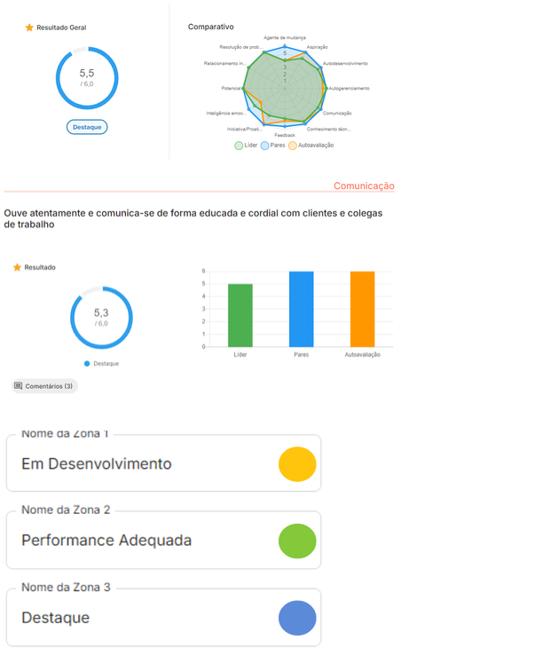

Avaliação de Desempenho (AD)

Você sabe o que é uma Avaliação de Desempenho (AD) e qual o seu propósito? 

Para te ajudar a entender melhor, trouxemos um conceito simples, mas que abraça algumas palavras-chave bem interessantes.

No Atlântico, podemos dizer que a Avaliação de Desempenho é um processo no qual você oferece e recebe feedback de outros atlantes com o objetivo de melhorar o desempenho de todos e por consequência da nossa organização. 

Ao longo desta página descrevemos vários itens relacionados à nossa avaliação de desempenho, explicando e esclarecendo conceitos importantes sobre esse universo do desempenho. Confira! 
O que objetiva a avaliação de desempenho do Atlântico?

    Promover um processo de avaliação transparente, justo e objetivo, aderente ao cenário atual do Atlântico;

    Garantir que os atlantes consigam identificar, a partir do resultado da avaliação, quais as competências que precisam ser desenvolvidas em seus skills (em português, quer dizer habilidades);

    Disponibilizar resultados como insumos relevantes para a definição da nossa política de remuneração e progressão do Atlântico. Sim, a nossa ideia é que a avaliação gere os insumos para que o processo de avaliação seja mais justo e transparente.

Por que avaliar?

    Para deixar claro aos atlantes o que o Atlântico e suas lideranças esperam e valorizam em seus profissionais e o que pensam a respeito de seu desempenho;

    Subsidiar a Política de Carreira e Remuneração nas situações de promoções, transferências e dimensionamento de quadro, integrando os processos de gestão de pessoas com as estratégias organizacionais;

    Dar feedback aos atlantes de como estão se saindo no trabalho e sugerir as mudanças necessárias, tanto no comportamento e atitudes, quanto nas habilidades ou conhecimentos;

    Identificar pontos fortes e aspectos a desenvolver de cada colaborador, fornecendo dados para a determinação de ações de desenvolvimento pessoal e profissional;

    Reforçar a comunicação entre lideranças e atlantes, motivando, orientando, acompanhando e dando um feedback sobre o seu desempenho

Quem avalia?

    Autoavaliação: cada pessoa se avalia quanto à sua performance, eficiência e eficácia, com base em parâmetros fornecidos por seu superior ou derivados de suas tarefas. São avaliadas as necessidades e carências pessoais para melhorar o desempenho, os pontos fortes e fracos, as potencialidades e fragilidades e o que é preciso reforçar para a melhoria dos resultados pessoais;

    Avaliação feita pela liderança: A liderança é o responsável pelo desempenho dos seus liderados e por sua constante avaliação e comunicação dos resultados;

    Avaliação feita pelos liderados: Da mesma forma que a liderança avalia o time, cada pessoa do time também contribui com a avaliação do seu líder imediato.

    Avaliação feita pelos pares: Pares são colegas que atuam próximos dentro do mesmo time ou compartilham o dia a dia de trabalho em processos ou atividades específicas. A ideia é que esses membros possam contribuir com a avaliação das pessoas com as quais tiveram maior contato nos últimos meses.

O que é avaliado?

Na avaliação são analisados os seguintes fatores:

    Soft Skills (competências comportamentais): Todas as pessoas serão avaliadas no mesmo escopo de competências comportamentais, definidas institucionalmente como ideais para o pleno exercício das funções aqui no Atlântico. Estão fortemente baseados nos valores organizacionais;

    Resultados: Esta seção avaliará aspectos como qualidade das entregas, produtividade e alcance dos resultados esperados para cada função;

    Potencial: Aqui será avaliado o potencial que o atlante demonstra ter para assumir maiores desafios e responsabilidades.

Confira as perguntas de cada bloco da avaliação acessando o formulário de avaliação na íntegra.
Hard Skills (competências técnicas)

Acabamos de entender quais são os fatores que compõe o formulário da avaliação de desempenho. Contudo existe um último fator que também faz parte do processo de avaliação, mas não está contido no formulário da avaliação. Estamos falando das Hard Skills.

Pensando em trazer um maior direcionamento para o desenvolvimento técnico dos atlantes, foi feito o mapeamento das principais competências técnicas necessárias a cada função da organização. A ideia deste mapeamento é apoiar as lideranças e times na análise de quais são os pontos de desenvolvimento técnico dos atlantes em relação a função e senioridade que ocupam.

O material serve também para planejamento de carreira, uma vez que os atlantes podem entender o que é esperado tecnicamente de funções e senioridades que desejam alcançar e com isso conseguem traçar um plano de desenvolvimento mais direcionado.

Para cada competência técnica mapeada, foi definido um nível desejável que varia de acordo com as diferentes senioridades daquela função, desse modo você pode entender qual o nível de conhecimento necessário a depender da função e senioridade que ocupa. Conheça a seguir os níveis de conhecimento:

    Não tem conhecimento: Não possui conhecimento nessa skill.

    Tem conhecimento: Compreende os conceitos teóricos, mas não tem prática. Necessita de forte orientação para realizar tarefas.

    Tem conhecimento e habilidade (CH) em nível básico: Entende os conceitos teóricos e consegue realizar algumas tarefas de forma independente, desde que receba orientação inicial.

    Tem conhecimento e habilidade (CH) em nível Intermediário: Tem um conhecimento sólido dos conceitos teóricos e consegue realizar a maioria das tarefas de forma independente, sem orientação.

    Tem conhecimento e habilidade (CH) em nível avançado: Domina os conceitos teóricos e é capaz de realizar qualquer tarefa de forma independente, sem necessidade de orientação.

    Multiplicador: Domina os conceitos teóricos e possui ampla experiência prática, sendo capaz de orientar e formar outras pessoas nessa habilidade.

Acesse o mapeamento de hard skills e consulte as informações da sua função:

    Comercial

    Inovação

    Operação

    Pessoas e Cultura

    Recursos Organizacionais

Ciclo da Avaliação de Desempenho

No Atlântico a avaliação segue um ciclo de 4 etapas, conforme ilustrado na figura abaixo:
Ciclo da avaliação de desempenho dividido em quatro etapas: 1.Definição das métricas da avaliação, Verde Piscina: 2. Alinhamento e Sensibilização, Em laranja: 3. Aplicação da Avaliação e Feedback, Em roxo: 4. Feedback, Construção dos PDIs e Monitoria.
Escala de avaliação

A escala de avaliação de desempenho permite que a pessoa avaliadora identifique se o comportamento analisado deve ser reconhecido como ponto forte ou deve ser evidenciado como ponto de desenvolvimento. 

O Atlântico adotou uma escala baseada na expectativa de entrega de cada senioridade na qual a pessoa avaliadora indica um dos níveis de expectativas que representa a percepção dela acerca da performance que observa na pessoa avaliada. As descrições dos itens da escala são:

    Não atende: Observando a função e senioridade que a pessoa ocupa, a visão é de que a pessoa precisa incorporar aquele item ao seu repertório de desenvolvimento;

    Em Desenvolvimento: Diferente do item anterior, aqui a percepção é de que a pessoa já possui algum nível de performance mas ainda não é suficiente para o que é esperado dela naquela função e senioridade, é necessário seguir desenvolvendo;

    Dentro do esperado para a função/senioridade: Neste item a pessoa avaliada é vista como atendendo ao que é esperado dela na função e senioridade que ocupa, ela faz muito bem aquilo que é esperado dela na posição em que ocupa;

    Acima do esperado para a função/senioridade: Aqui a ideia é de excedente, ou seja, a pessoa avaliada está entregando algo que vai além do que é esperado dela na função e senioridade que ocupa.

Confira o dicionário de expectativas para entender o que é esperado em termos de performance em cada item da avaliação de cada senioridade.
Dicas para uma boa avaliação

    Avalie lembrando-se de fatos concretos e comportamentos do colaborador avaliado que justifiquem a avaliação de cada item;

    Deixe de lado sua impressão pessoal sobre a pessoa avaliada, foque em acontecimentos que você observou no trabalho;

    Avalie considerando o período desde a última avaliação da pessoa. Se for a primeira vez que a avalia, considere os acontecimentos entre a última avaliação e a que você está participando;

    Foque na descrição do item que está avaliando e pontue na escala de expectativas. Lembre de utilizar o dicionário de expectativas para ajudá-lo nessa análise;

    Os comentários são opcionais, mas extremamente recomendados para que o processo de avaliação seja mais rico. Suas respostas são confidenciais e não são exibidas para outros atlantes. 

Devolutiva

Após a avaliação de desempenho, é realizada a devolutiva aos atlantes para deixar claro os feedbacks da avaliação. Este momento é conduzido pelas lideranças junto aos times e tem com finalidade gerar o entendimento do relatório para que fique claro quais ações de desenvolvimento podem ser planejadas para a carreira de cada pessoa. Nesta etapa ainda é possível pleitear a revisão de notas, mas isso fica a critério da liderança avaliar a necessidade de ajustes.
Relatório de Desempenho da Avaliação

Abaixo, você pode ver um exemplo de como os resultados aparecem em seu relatório de avaliação.

E o que são as zonas de resultados?

No seu relatório de desempenho, suas notas virão representadas por meio de uma legenda subdividida em 3 zonas:

Em desenvolvimento: Significa que a média das notas das pessoas que te avaliaram indica que aquele item precisa de atenção e representa algo para você focar em desenvolver.

Performance Adequada: Nesta zona, a interpretação é que a média das notas que você recebeu traduz que a visão dos avaliadores é de que você está dentro das expectativas desejadas para aquele item.

Destaque: Nesta zona, a média das notas vai indicar que você superou as expectativas de desenvolvimento na visão das pessoas que te avaliaram.

Os valores que representam os limites de cada zona são definidos a cada ciclo de avaliação e divulgados nos momentos de sensibilização deste processo.
PDI e Avaliação de Desempenho. Como se conectam?

Após uma Avaliação de Desempenho é fundamental traçar estratégias de aprendizagem para os colaboradores por meio da construção do PDI.

O PDI é uma ferramenta poderosa e eficiente para a gestão de carreiras. Isso porque, normalmente, os planos de desenvolvimento individuais são criados a partir dos resultados de uma avaliação de desempenho e com objetivos específicos, tais como: melhorar habilidades interpessoais, implementar novos projetos ou ainda preparar para uma nova função/cargo.
Informações Adicionais

Quantos ciclos acontecem por ano?

1 ciclo: Acontece em Julho. Lembrando que os meses podem variar de acordo com o calendário da organização.

Quem participa das avaliações?

Todos os atlantes, exceto aqueles com menos de 4 meses de admissão. Esse é o período mínimo que entendemos ser necessário para avaliar de forma criteriosa o desempenho das pessoas. Nesses casos, após o período de 4 meses, é recomendado que seja elaborado o primeiro PDI do atlante, para que sejam trabalhadas ações de desenvolvimento.

O que é a heurística?

É um tratamento estatístico aplicado sobre as notas finais das avaliações de desempenho dos atlantes, com o objetivo de desconsiderar as influências que enviesam a análise dos resultados. Esse tratamento gera uma segunda nota (nota normalizada) que, por sua vez, será utilizada pelo Comitê do Plano de Carreira para apresentação dos resultados finais do ciclo da avaliação de desempenho.

Caso queira informações sobre o processo de promoção e bonificação clique aqui.

Dúvidas e sugestões: desenvolvimentoecarreira@atlantico.com.br