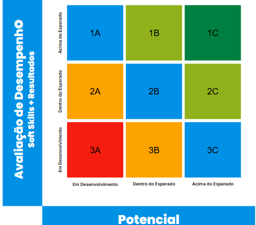

Promoção e Bonificação

Valorização de Pessoas é um dos valores do Atlântico!

Reconhecer quem faz a diferença e poder vibrar com o crescimento das pessoas está no centro do propósito da nossa organização.

Uma das maneiras que o Atlântico realiza isso é por meio das práticas de promoção e bonificação. A seguir falaremos de cada uma delas e como você atlante pode trabalhar para alcançá-las.
Tipos de Valorização

Aqui no Atlântico temos 3 principais tipos de valorização:

Progressão (promoção horizontal)

Aumento de salário sem mudança de função/senioridade. Este tipo de valorização vem em consequência de um desempenho superior somado a outras entregas e percepção de crescimento profissional.

Promoção Vertical

Mudança de função e/ou senioridade proveniente do amadurecimento e percepção do aumento no nível de entrega do profissional. O aumento salarial vem como consequência da ampliação do escopo de atuação que será dado ao atlante.

Bonificação

Valor financeiro dado de maneira pontual ao atlante em função do desempenho extraordinário percebido no período.
O que é considerado na análise?

    Avaliação de Desempenho: O resultado da última avaliação de desempenho será considerado como um dos fatores para a análise da liderança optar ou não pela concessão de um dos tipos de valorização. Para saber mais informações, clique aqui;

    Matriz 9box: A liderança utilizará como insumo as informações da matriz para identificar e reconhecer talentos dentro do time. A seguir detalharemos essa metodologia;

    Critérios Institucionais: O Atlântico definiu ações, entregas e objetivos de desenvolvimento para dimensionar o quanto os atlantes buscaram investir no seu desenvolvimento profissional e engajaram-se em iniciativas vistas como relevantes para a organização. Logo mais traremos esses critérios em detalhe;

    Orçamento: Uma das premissas da valorização de pessoas é a verba que as áreas terão para distribuir. A partir dela é que a liderança utilizará as demais informações para priorizar e tomar decisões.

Além desses critérios, a liderança poderá utilizar quaisquer outras informações que possam contribuir com a análise por exemplo o contexto e os desafios que o time enfrentou no período.
Matriz 9Box

A matriz é representada por um quadrante de 9 posições formado a partir do cruzamento de 2 eixos:

Desempenho: valor resultante da média das notas do bloco de soft skills e resultados da sua avaliação de desempenho.

Potencial: valor resultante da média de notas do bloco de potencial da sua avaliação de desempenho.

Cada eixo possui 3 níveis de avaliação possível: abaixo do esperado, dentro do esperado e acima do esperado. Cada pessoa será posicionada na matriz de acordo com o cruzamento de notas que obteve em cada eixo apresentado anteriormente. Os limites da matriz são definidos a partir dos valores de cada ciclo de avaliação.

Uma vez que a matriz é gerada, as lideranças conseguem obter análises sobre o nível de desempenho das pessoas. Apenas as lideranças terão acesso aos resultados da matriz.

Aqui no Atlântico, essa matriz orientará algumas das regras da nossa política de concessão de progressões, promoções e bonificações, vejamos a seguir:

Para facilitar o entendimento, nomeamos cada box da matriz com um identificador composto por uma letra e um número.

Regras de Valorização

    Box 1C - Pessoas posicionadas nesta box estão aptas a receber promoção horizontal (até 2 steps), promoção vertical e/ou bonificação de até 60% do valor do seu salário;

    Box 1B e 2C - Pessoas posicionadas nestas boxes estão aptas a receber promoção horizontal (1 step) e/ou bonificação de até 40% do valor do seu salário;

    Box 2B - Pessoas posicionadas nesta box estão aptas a receber bonificação de até 20% do valor do seu salário. 

Nenhuma das regras concede automaticamente a promoção (vertical ou horizontal) ou bonificação. Elas são norteadores para a análise das lideranças. A partir dessas regras, cada liderança analisará os demais critérios para tomar suas decisões.
Critérios Institucionais

Os critérios são agrupados em 2 tipos:

Excludentes: Estes critérios, caso não sejam alcançados, inabilitam a pessoa a concorrer a determinado tipo de valorização, ainda que ela tenha tido um bom desempenho.

Adicionais: Estes critérios, caso não sejam alcançados, não inabilitam a pessoa a concorrer a determinado tipo de valorização, mas podem contar positivamente para análise em casos de desempate ou priorização por parte das lideranças.

Conheça a seguir os critérios institucionais e como eles contribuem para cada tipo de valorização (se são excludentes ou adicionais):

Lista de Critérios Institucionais.

Ao longo do ano, cada pessoa é responsável por registrar as evidências de seus critérios alcançados. Ao final do processo esses registros serão auditados para confirmar a veracidade das informações.

Dúvidas e sugestões: desenvolvimentoecarreira@atlantico.com.br